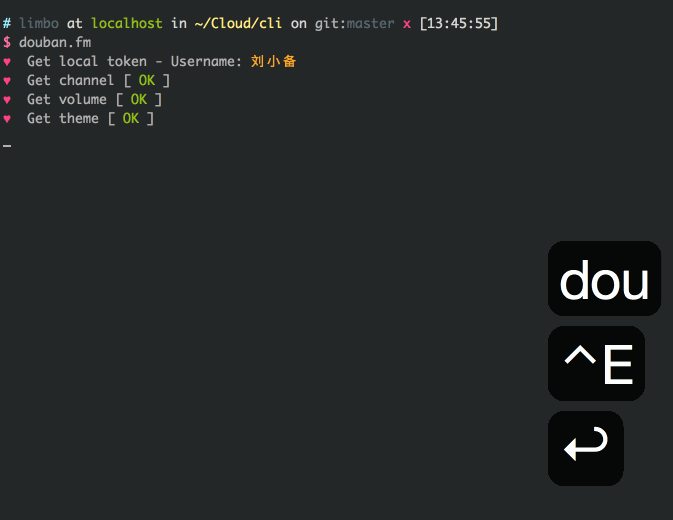

##douban.fm [](https://www.quantifiedcode.com/app/project/459f324d372447d992c04df79c1f5615)

Terminal-based douban.fm inspired by [douban.fm](https://github.com/turingou/douban.fm).

### Developer Wiki

https://github.com/taizilongxu/douban.fm/wiki

### Authors

* [Fansion](https://github.com/Fansion)
* [Cloverstd](https://github.com/cloverstd)
* [skyline75489](https://github.com/skyline75489)
* [Hexcles](https://github.com/Hexcles)
* [killpanda](https://github.com/killpanda)

### Screenshots

V0.4.1



### Support

Linux / OS X

### Installation

    $ sudo pip install douban.fm

需要mplayer播放器依赖,如未安装:

Ubuntu:

    $ sudo apt-get install mplayer

OS X:

    $ brew install mplayer

### Update

    $ sudo pip install --upgrade douban.fm

### Usage

在终端下直接输入

    $ douban.fm

### Login

第一次登陆需要输入账号,密码,程序不会保留密码,而是保存返回的token存储在~/.douban_token.txt,下次登陆无需输入密码.

### Keys

支持vim按键

```
移动
 [j]     --> 下
 [k]     --> 上
 [g]     --> 移到最顶
 [G]     --> 移到最底
音乐
 [space] --> 播放
 [w]     --> 打开歌曲专辑豆瓣主页
 [n]     --> 下一首
 [r]     --> 喜欢/取消喜欢
 [b]     --> 不再播放
 [q]     --> 退出
 [p]     --> 暂停
 [l]     --> 单曲循环
音量
 [=]     --> 增
 [-]     --> 减
 [m]     --> 静音
 [e]     --> 播放/历史/红心列表
歌词
 [o]     --> 显示歌词
 [q]     --> 退出歌词
帮助
 [h]     --> 查看快捷键
主题
 [1]
 [2]
 [3]
 [4]
```

### Configuration

.doubanfm_config保存在了~/.doubanfm_config,根据需要可以修改按键的映射

```
[key]
UP = k       # 上
DOWN = j     # 下
TOP = g      # 顶
BOTTOM = G   # 底
OPENURL = w  # 打开歌曲主页
RATE = r     # 标记喜欢/取消喜欢
NEXT = n     # 下一首
BYE = b      # 不再播放
QUIT = q     # 退出
PAUSE = p    # 暂停
LOOP = l     # 单曲循环
MUTE = m     # 静音
LRC = o      # 歌词
HELP = h     # 查看帮助
```

### TODO

* 播放歌曲数 红心数 不再播放数
* 离线歌曲
* 兼容mvp播放器


### Reference

* [豆瓣FM命令行播放器(pyfm)](https://github.com/skyline75489/pyfm)
* [豆瓣电台 API](https://github.com/zonyitoo/doubanfm-qt/wiki/%E8%B1%86%E7%93%A3FM-API)

###Log

V0.4.2(未发布) 网易320k音乐替换原音乐

V0.4.0 重构项目, 更快的页面切换时间, 更清晰的逻辑

V0.3.0 改进mplayer交互,歌词匹配更准确,增加了Playlist,History,Rate几个标签页,音量调节转换为 mplayer 音量内部调节,退出时会保存频道和音量,等等

V0.2.15 支持 last.fm ,增加显示

V0.2.14 修正上个版本声卡BUG, 优化歌词同步,增加官方歌词

V0.2.13 增加help页面,修改声卡兼容问题,优化线程增加切歌速度

V0.2.12 歌词界面美化

V0.2.11 config兼容问题

V0.2.10 滚动歌词,单曲循环,暂停,静音

V0.2.9 支持歌词,支持Mac OS X

V0.2.8 增加config

### License (MIT)

Copyright (c) 2014-2015 hackerxu
