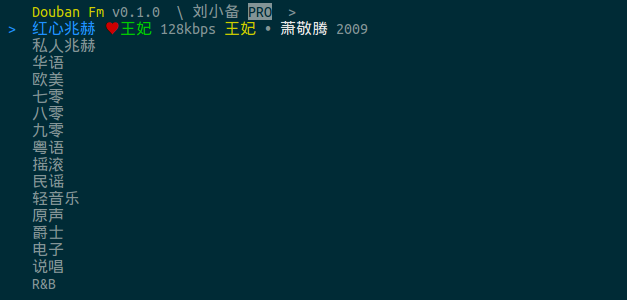

##Douban FM v0.1.0

目前只支持linux,其他平台暂时未做测试,但是只要满足python2.7理论上就可以运行

这个版本cli是参考了 node.js版本的[douban.fm](https://github.com/turingou/douban.fm)制作的,因为自己不熟悉node.js,不能PR,所以做了这个个python版本,而且python版本需要安装的依赖更少,尚有部分功能还未添加,长期维护中.欢迎PR

###使用

    python douban.py

###登陆

第一次登陆需要输入账号,密码,程序不会保留密码,而是保存返回的token存储在.douban_token.txt,下次登陆无需输入密码.

###依赖

需要mplayer播放器依赖,如未安装:

    sudo apt-get install mplayer

###按键

支持vim按键

* j 下
* k 上
* g 移到最顶
* G 移到最底
* n 下一首
* r 喜欢/取消喜欢
* b 不再播放
* space 播放

###已完成功能

* 登陆token
* 显示PRO 暂时只支持最高128kbps
* cli设计
* 播放,下一首,红心,不再播放

###TODO

* 歌曲暂停
* 歌曲结束request
* 播放歌曲数 红心数 不再播放数
* 进度条
* 歌词
* 终端高度的自动调整

###参考资料

* node.js版本的[douban.fm](https://github.com/turingou/douban.fm)
* [豆瓣电台 API](https://github.com/zonyitoo/doubanfm-qt/wiki/%E8%B1%86%E7%93%A3FM-API)
